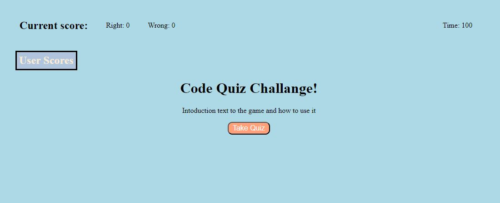
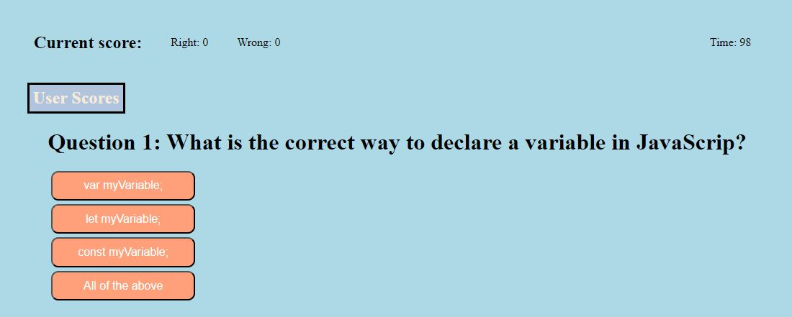

# JavaScript Code Quiz
<!-- Title  -->

Code quiz that poses several quiz questions that can be updated in the future to be a study aid
---

## Table of Contents

<!-- Table of Contents -->

- [About The Project](#about_project)
- [Challenges](#challenges)
- [Deployment Location](#deployment_location)
- [Screen Shots](#screen-shots)

---

## About The Project 

<!-- About the Project -->
The Code Quiz was built using JavaScript, HTML, and CSS. It iterates through the questions and checks if the answer is correct. When correct the right counter increase by 1. If incorrect the wrong counter increase and time decrease by 5 seconds. 

If time runs out, it will go to a game over screen where you can restart the game.

When all the questions are answered it will then ask for your initials and then track the score locally. 

From there you are givin the option to restart the quiz again or to clear out the scores. 

On the home screen and while answering questions you are able to click on the user score text which will take you to the score sceen. From there you can then restart or clear the scores.  

---

## Challenges 
There was some issues with I was accidentally putting .addEventListener inside of another .addEventListener. Also had a issue with having the .addEventListener having to much elements nesting inside of it and causing incorrect clicks. 
<!-- Challenges -->

---

## Deployment Location 

<!-- Deployment Location -->
https://truemiguel.github.io/04-Code-Quiz/

---

## Screen Shots 

<!-- Resources -->

---
